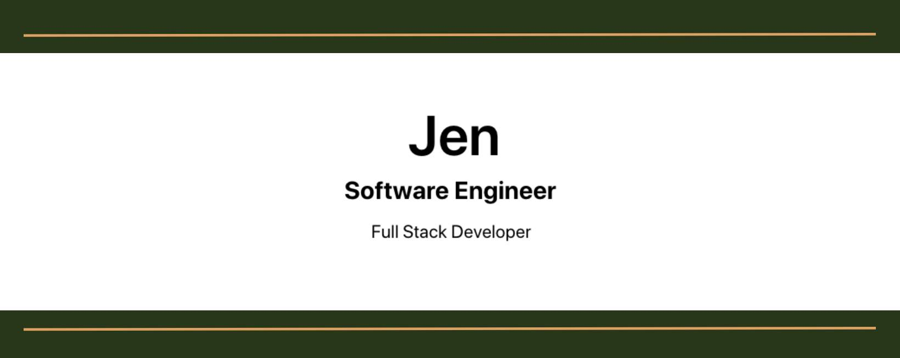

<h1 align="center">Hello World, I'm Jen!</h1>
<h3 align="center">A dedicated Software Engineer from New England</h3>

I aim to create web applications that are both user-friendly and aesthetically pleasing.  As a full stack developer, I have an undeniable love for building things (from web apps to Lego toys), I enjoy turning large complex problems into small simple concepts.

<h3 align="center">Currently...</h3>

- Working with a team to build a React Flashcard App

- Working solo to learn Python Django Blog

- Click to view [my portfolio](https://jenscode.com/)

- Contact me at **jennifer.stemkowski@gmail.com**

<h3 align="left">Languages and Tools:</h3>

- Frontend
    - JavaScript
    - React
    - Next.js
    - Redux
    - Tailwind
    - Bootstrap
    - CSS
    - HTML
    - jQuery
    - Jupyter Notebook
    - Mongoose
    - TypeScript

- Backend
    - Node.js
    - Express.js
    - GraphQL
    - Python
    - Django
    - Flask
    - AWS
    - REST API
    - C#

- Database
    - MongoDB
    - MySQL
    - SQL
    - NoSQL
    - PostgreSQL
    - Git

- Tools
    - GitHub
    - GitLab
    - VS Code
    - Insomnia
    - Netlify
    - Heroku
    - Wordpress
    - Adobe Photoshop
    - Slack

 
<h3 align="center">Connect with me:</h3>

 

 

 Created with 💚 by Jen Stemkowski</a>

